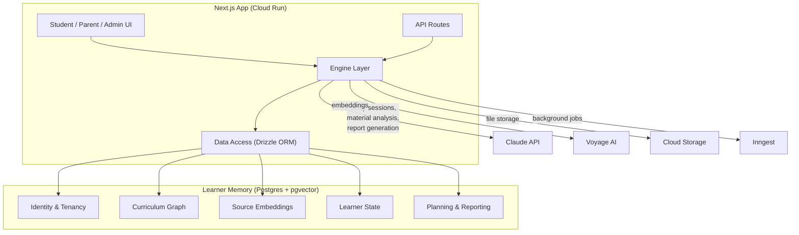
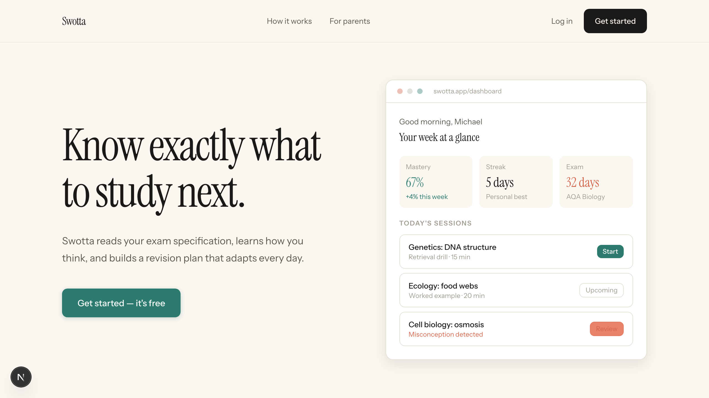
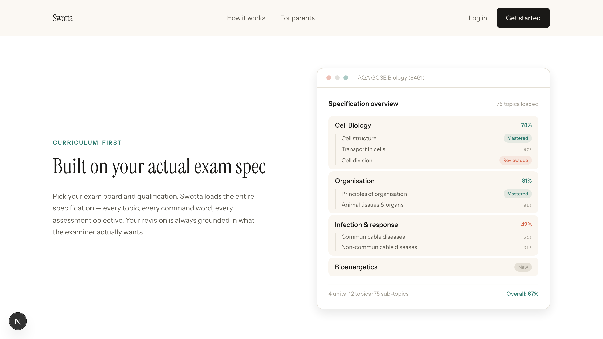
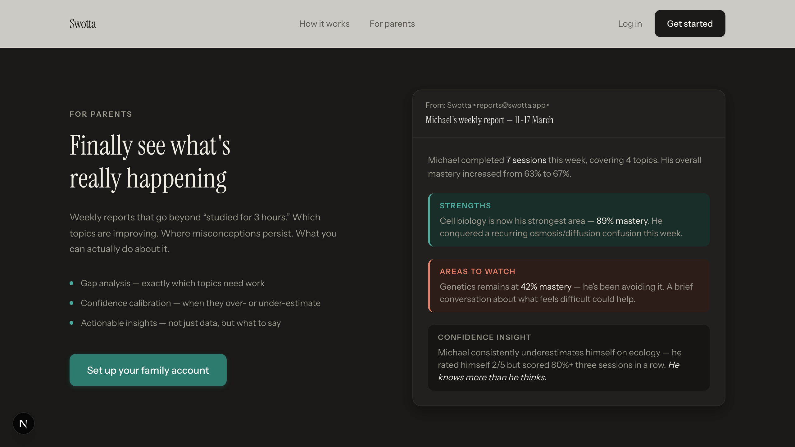

# Swotta

One student, one academic state. A structured memory architecture for learning, built on the thesis that giving an AI tutor rich, persistent context about a learner — what they know, what they've forgotten, where they're miscalibrated, what's worked before — produces fundamentally better interactions than a blank-context chatbot with a curriculum prompt.

Swotta models seven distinct types of learner memory (mastery, retention, misconceptions, confidence calibration, behavioural patterns, learning preferences, and source materials), persists all of them in a single Postgres instance alongside the curriculum graph and vector embeddings, and uses that assembled context to power guided study sessions via Claude.

**Built as a solo project by [Jesse Merrigan](https://github.com/Jesse-L-M).**

### Proof

- 40+ tables across 5 schema layers (identity, curriculum, sources, learner state, planning)
- 16 engine modules: scheduling, mastery, sessions, ingestion, reporting, diagnostics, behaviour, memory, notifications, proximity, policies, and more
- 15 AI prompt templates for distinct study session modes, each receiving structured learner context
- 1,600+ tests across 84 files
- 0 ESLint errors, 0 warnings, strict TypeScript throughout
- Full architecture, schema, interface, and design system documentation

---

## Why this exists

I'm interested in how memory works — the biological kind and the computational kind. How spaced repetition exploits the forgetting curve. How retrieval practice strengthens recall more than re-reading. How confidence calibration (knowing what you don't know) is the skill most students lack and most revision tools ignore.

I'm also deep into agentic AI systems, specifically the memory problem: how you give an AI enough structured context about a person that it can do something genuinely useful rather than just responding to a prompt. The interesting engineering problem isn't the chat interface — it's the context assembly.

Swotta is where those interests meet. The practical goal is a system that helps UK students revise for GCSEs and A-Levels. The deeper goal is exploring how structured, persistent memory makes AI interactions meaningfully better.

See [`LEARNER_MEMORY.md`](LEARNER_MEMORY.md) for the full memory model specification.

---

## Architecture



The key architectural bet: **one Postgres for everything.** Relational data, vector embeddings, and learner state live in the same database. Source retrieval, mastery lookups, and scheduling decisions happen in one transaction — no separate vector store to sync, no eventual consistency between what the system knows and what it retrieves.

Cloud Run stays stateless. Conversation history is managed client-side; only outcomes and state transitions are persisted. The interesting state is the learner's accumulated memory, not the session transcript.

### Key design choices

- **Candidate vs confirmed memory.** Inferred patterns ("seems to prefer visual explanations") are held as candidates with evidence counts. They're promoted to confirmed only when evidence crosses a threshold or a human explicitly confirms. This models uncertainty in user profiling rather than storing flat preferences.

- **Guided AI, not answer generation.** Study sessions explain, quiz, and coach. Claude never writes the essay for the student. Global policy enforces this.

- **Five-layer policy resolution.** Constraints resolve through global, qualification, org, class, and learner layers with most-specific-wins semantics. A school can say "no AI-generated essays"; a teacher can focus on Paper 2 topics this term; a learner can have individual accommodations.

- **Household as organisation.** The same identity/membership/tenancy model supports B2C families and B2B schools. No separate code paths.

---

## Screenshots

### Landing page



### Curriculum structure



### Parent reporting



---

## What exists today

- Full relational schema: 40+ tables modelling identity, curriculum graphs, source ingestion, learner state, and planning/reporting
- Curriculum loader with idempotent seeding from exam specification JSON (GCSE Biology AQA, 75 topics, command words, misconception rules)
- Ingestion pipeline: PDF/DOCX text extraction, semantic chunking, Voyage AI embeddings in pgvector, Claude-based topic classification with confidence scores
- Scheduler: modified SM-2 spaced repetition with exam proximity weighting, behavioural signal integration, 8 study block types
- Study session runner: streaming Claude sessions with structured context assembly (mastery, misconceptions, confirmed memory, retrieved sources, qualification rules)
- Reporting engine: weekly reports with mastery deltas, misconception narratives, confidence calibration, safety flag detection
- Behaviour analysis: avoidance patterns, disengagement detection, confidence miscalibration tracking
- Memory engine: candidate/confirmed memory lifecycle, evidence accumulation, promotion logic
- Policy engine: five-layer resolution with most-specific-wins semantics
- Student and guardian UI: onboarding, dashboard, study sessions, source upload, parent reporting
- Firebase Auth with session cookies, role-based route protection
- CI/CD: GitHub Actions (lint, typecheck, test on PR; deploy on merge)
- Terraform modules for GCP deployment (Cloud Run, Cloud SQL, Cloud Storage, IAM, networking)

## What I'm building next

- Diagnostic conversation flow that seeds initial mastery state from a structured AI conversation (partially built, refining)
- Cross-topic misconception clustering — detecting when misconceptions across different topics share a common root
- Richer source analysis: extracting question types and command words from past papers, mapping to mark scheme patterns
- Student weekly email with personalised study plan and encouragement grounded in real progress data

## What I'm trying to prove

- That structured learner memory (not just chat history) materially improves AI tutoring quality
- That confidence calibration and misconception tracking are higher-leverage signals than raw mastery scores
- That the candidate/confirmed memory pattern is a practical way to handle uncertainty in user modelling
- That a single Postgres instance with pgvector can handle relational state + vector retrieval without the operational complexity of a separate vector store

See [`EVALS.md`](EVALS.md) for the evaluation plan. See [`ROADMAP.md`](ROADMAP.md) for the full roadmap.

---

## Stack

| Layer | Choice | Why |
|-------|--------|-----|
| Framework | Next.js 15, React 19 | Full-stack TypeScript, streaming for AI sessions |
| Database | PostgreSQL 16 + pgvector | Relational + vector in one DB, atomic transactions |
| ORM | Drizzle | Schema-as-TypeScript, fine-grained SQL for graph queries |
| Auth | Firebase Auth | Google Sign-In (universal in UK schools), GCP ecosystem |
| AI | Claude API (Anthropic SDK) | Study sessions, material analysis, report generation |
| Embeddings | Voyage AI (1024d) | Colocated with relational data in pgvector |
| File storage | Google Cloud Storage | Signed URLs for student uploads |
| Background jobs | Inngest | Durable, retryable, typed async functions |
| Email | Resend | Parent weekly reports |
| Hosting | Cloud Run + Cloud SQL | Long timeouts for AI sessions, europe-west2 |
| Infrastructure | Terraform | Modular GCP config |

Full rationale in [`docs/DECISIONS.md`](docs/DECISIONS.md).

## Repository structure

```
src/
  engine/       Core domain: scheduling, mastery, sessions, reporting, diagnostics, memory
  ai/           Claude integration, Voyage embeddings, 15 prompt templates (Markdown)
  db/schema/    Drizzle schema — 40+ tables across 5 layers
  app/          Next.js routes: marketing, auth, learner, guardian, API
  components/   UI: dashboard, onboarding, sessions, sources, parent views
  lib/          Auth, types, logging, database
  email/        Resend templates
inngest/        Background jobs
terraform/      GCP infrastructure modules
tests/e2e/      Playwright flows
```

Documentation: [Architecture](docs/ARCHITECTURE.md) | [Schema](docs/SCHEMA.md) | [Interfaces](docs/INTERFACES.md) | [Decisions](docs/DECISIONS.md) | [Design system](DESIGN.md) | [Learner memory](LEARNER_MEMORY.md) | [Evals](EVALS.md) | [Roadmap](ROADMAP.md)

## Running locally

```bash
npm ci
docker compose up -d        # Postgres + pgvector
cp .env.example .env.local  # Fill in credentials
npm run db:push             # Apply schema
npm run dev
```

AI, auth, and ingestion features need real service credentials. The UI shell, schema, and local development work without them.

## Verification

```bash
npx tsc --noEmit       # Passes
npm run test:run       # 84 files, 1605 tests
npx eslint src/        # 0 errors, 0 warnings
```

## License

[Polyform Noncommercial 1.0](LICENSE) — source available for reading, learning, and non-commercial experimentation.
